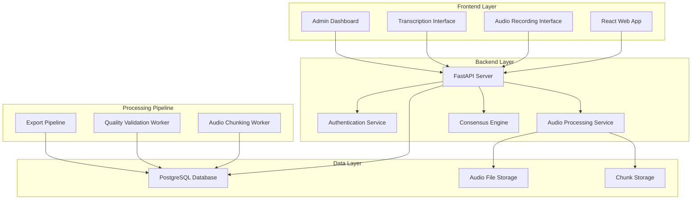

# Design Document

## Overview

The Voice Data Collection Platform is a web-based crowdsourcing system for collecting Bangla voice recordings and transcriptions to train Sworik AI. The platform consists of a React frontend, Go backend API, PostgreSQL database, and intelligent audio processing pipeline. The system supports two primary workflows: voice recording with script reading, and audio transcription with quality validation through consensus mechanisms.

## Architecture

### High-Level Architecture



### Technology Stack

- **Frontend**: React with TypeScript, Tailwind CSS for styling
- **Backend**: Python with FastAPI framework for high-performance async API
- **Database**: PostgreSQL with JSONB support for metadata
- **Storage**: MinIO or S3-compatible object storage for audio files
- **Authentication**: JWT tokens with role-based access control
- **Audio Processing**: librosa, pydub, soundfile for intelligent chunking, WebRTC for browser recording
- **Background Jobs**: Celery with Redis for distributed task processing

## Components and Interfaces

### 1. Frontend Components

#### Voice Recording Interface
- **Purpose**: Capture voice recordings from contributors
- **Key Features**:
  - Duration selection (2, 5, 10 minutes)
  - Random script display with Bangla text rendering
  - Real-time audio recording using Web Audio API
  - Progress indicators and recording controls
  - Upload progress tracking

#### Transcription Interface
- **Purpose**: Enable contributors to transcribe audio chunks
- **Key Features**:
  - Sentence quantity selection (2, 5, 10, 15, 20)
  - Audio playback controls with waveform visualization
  - Text input with Bangla keyboard support
  - Skip functionality for unclear audio
  - Progress tracking and submission

#### Admin Dashboard
- **Purpose**: Platform management and monitoring
- **Key Features**:
  - User management with role assignment
  - Script repository management
  - Data quality monitoring and reports
  - Export controls for Sworik developers
  - System health and usage analytics

### 2. Backend Services

#### Authentication Service
```python
from abc import ABC, abstractmethod
from typing import Optional, Dict, Any
from dataclasses import dataclass

class AuthService(ABC):
    @abstractmethod
    async def login(self, email: str, password: str) -> tuple[Optional['User'], Optional[str]]:
        pass
    
    @abstractmethod
    async def validate_token(self, token: str) -> Optional['User']:
        pass
    
    @abstractmethod
    def has_permission(self, user: 'User', permission: str) -> bool:
        pass

@dataclass
class User:
    id: int
    name: str
    email: str
    role: str  # contributor, admin, sworik_developer
    metadata: Dict[str, Any]
```

#### Audio Processing Service
```python
from abc import ABC, abstractmethod
from typing import List, Optional
from dataclasses import dataclass

class AudioProcessor(ABC):
    @abstractmethod
    async def process_recording(self, recording_id: int) -> None:
        pass
    
    @abstractmethod
    async def chunk_audio(self, file_path: str) -> List['AudioChunk']:
        pass
    
    @abstractmethod
    async def validate_audio_quality(self, file_path: str) -> 'QualityMetrics':
        pass

@dataclass
class AudioChunk:
    id: int
    recording_id: int
    chunk_index: int
    file_path: str
    start_time: float
    end_time: float
    duration: float
    sentence_hint: Optional[str] = None
```

#### Consensus Engine
```python
from abc import ABC, abstractmethod
from typing import List
from dataclasses import dataclass

class ConsensusEngine(ABC):
    @abstractmethod
    async def evaluate_transcriptions(self, chunk_id: int) -> 'ConsensusResult':
        pass
    
    @abstractmethod
    def calculate_quality_score(self, transcriptions: List['Transcription']) -> float:
        pass
    
    @abstractmethod
    async def flag_for_review(self, chunk_id: int, reason: str) -> None:
        pass

@dataclass
class ConsensusResult:
    chunk_id: int
    consensus_text: str
    confidence_score: float
    requires_review: bool
    participant_count: int
```

### 3. API Endpoints

#### Voice Recording Endpoints
- `GET /api/scripts/random?duration={minutes}` - Get random script by duration
- `POST /api/recordings` - Upload voice recording
- `GET /api/recordings/user/{userID}` - Get user's recordings

#### Transcription Endpoints
- `GET /api/chunks/random?count={number}` - Get random chunks for transcription
- `POST /api/transcriptions` - Submit transcription
- `GET /api/transcriptions/user/{userID}` - Get user's transcriptions

#### Admin Endpoints
- `GET /api/admin/stats` - Platform statistics
- `GET /api/admin/users` - User management
- `POST /api/admin/scripts` - Add new scripts
- `GET /api/admin/quality-review` - Flagged items for review

#### Export Endpoints (Sworik Developers Only)
- `GET /api/export/dataset?filters={}` - Export validated dataset
- `GET /api/export/metadata` - Export metadata and statistics

## Data Models

### Database Schema

Based on the existing DB_DESIGN.md, the core tables are:

```sql
-- Core entities
users (id, name, email, role, metadata, created_at)
languages (id, name, code, created_at)
scripts (id, text, duration_category, language_id, metadata, created_at)

-- Voice data
voice_recordings (id, user_id, script_id, file_path, duration, language_id, status, metadata, created_at)
audio_chunks (id, recording_id, chunk_index, file_path, start_time, end_time, duration, sentence_hint, metadata, created_at)

-- Transcription data
transcriptions (id, chunk_id, user_id, text, language_id, quality, confidence, created_at)
quality_reviews (id, transcription_id, reviewer_id, decision, rating, comment, created_at)
```

### Data Relationships

- One recording can have many chunks (1:N)
- One chunk can have many transcriptions (1:N)
- One transcription can have many quality reviews (1:N)
- Users can create many recordings and transcriptions (1:N)

## Error Handling

### Audio Processing Errors
- **Chunking Failures**: Fallback to time-based splitting if intelligent chunking fails
- **File Corruption**: Validate audio files on upload and reject corrupted files
- **Storage Errors**: Implement retry mechanisms with exponential backoff

### Transcription Errors
- **Consensus Conflicts**: Flag chunks with low agreement for manual review
- **Quality Issues**: Implement contributor reputation system to weight transcriptions
- **Missing Data**: Handle cases where chunks have no transcriptions

### System Errors
- **Database Failures**: Implement connection pooling and failover mechanisms
- **Authentication Errors**: Provide clear error messages and secure token handling
- **Rate Limiting**: Implement per-user limits to prevent abuse

## Testing Strategy

### Unit Testing
- **Backend Services**: Test all service methods with mock dependencies
- **Audio Processing**: Test chunking algorithms with sample audio files
- **Consensus Engine**: Test transcription comparison and scoring logic
- **Authentication**: Test JWT token generation and validation

### Integration Testing
- **API Endpoints**: Test all REST endpoints with various input scenarios
- **Database Operations**: Test CRUD operations and complex queries
- **File Upload/Download**: Test audio file handling and storage operations

### End-to-End Testing
- **Recording Workflow**: Test complete voice recording and chunking process
- **Transcription Workflow**: Test audio playback and transcription submission
- **Admin Functions**: Test user management and data export features

### Performance Testing
- **Concurrent Users**: Test platform with multiple simultaneous users
- **Large File Handling**: Test with various audio file sizes and formats
- **Database Performance**: Test query performance with large datasets

## Security Considerations

### Authentication & Authorization
- JWT tokens with short expiration times and refresh mechanism
- Role-based access control with granular permissions
- Secure password hashing using bcrypt or similar

### Data Protection
- HTTPS enforcement for all communications
- Audio file encryption at rest in object storage
- Database encryption for sensitive user data
- Regular security audits and vulnerability assessments

### Access Control
- Strict export permissions limited to Sworik developers
- Audit logging for all data access and export operations
- Rate limiting to prevent abuse and data scraping
- Input validation and sanitization for all user inputs

## Deployment Architecture

### Production Environment
- **Load Balancer**: Nginx or cloud load balancer for traffic distribution
- **Application Servers**: Multiple FastAPI server instances with Uvicorn/Gunicorn
- **Database**: PostgreSQL with read replicas for scaling
- **Storage**: Distributed object storage with CDN for audio delivery
- **Background Workers**: Celery workers for audio processing tasks
- **Monitoring**: Prometheus and Grafana for system monitoring

### Development Environment
- **Local Development**: Docker Compose for easy setup
- **CI/CD Pipeline**: Automated testing and deployment
- **Staging Environment**: Production-like environment for testing
- **Database Migrations**: Automated schema management

## Performance Optimization

### Audio Processing
- **Parallel Processing**: Use Celery workers to process multiple recordings simultaneously
- **Intelligent Chunking**: Leverage librosa for VAD and pydub for precise audio manipulation
- **Caching**: Cache frequently accessed chunks and metadata
- **Compression**: Use efficient audio codecs for storage optimization
- **CLI Integration**: Reuse existing Python CLI components for consistent processing

### Database Optimization
- **Indexing**: Strategic indexes on frequently queried columns
- **Query Optimization**: Optimize complex queries for consensus calculation
- **Connection Pooling**: Efficient database connection management

### Frontend Optimization
- **Code Splitting**: Lazy load components for faster initial load
- **Audio Streaming**: Progressive audio loading for large files
- **Caching**: Browser caching for static assets and API responses