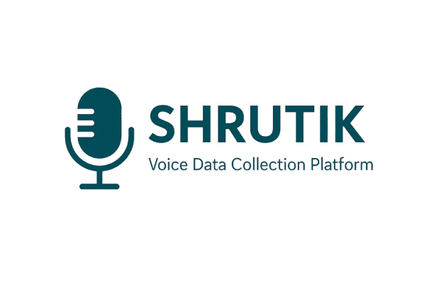

# Shrutik (শ্রুতিক) - Voice Data Collection Platform

<div align="center">



**Empowering Communities Through Voice Technology**

[](https://opensource.org/licenses/MIT)
[](https://www.python.org/downloads/)
[](https://fastapi.tiangolo.com/)
[](https://reactjs.org/)

</div>

## 🌟 Vision

Shrutik (শ্রুতিক) is an open-source crowdsourcing platform designed to democratize voice technology for underrepresented languages. Named after the Bengali word meaning "listener" or "one who hears," Shrutik bridges the digital divide by enabling communities to contribute their voices and build inclusive AI systems.

## 🎯 Why Shrutik?

In a world where voice technology is rapidly advancing, millions of speakers of regional and minority languages are left behind. Major voice assistants and speech recognition systems work poorly or not at all for languages like Bengali, Tamil, Urdu and hundreds of others spoken by billions of people.

**Shrutik changes this narrative by:**

- 🗣️ **Empowering Communities**: Enabling native speakers to contribute voice data in their own languages
- 🌍 **Preserving Linguistic Diversity**: Capturing the rich variations, dialects, and accents within languages  
- 🤝 **Democratizing AI**: Making voice technology accessible to underrepresented communities
- 🔓 **Open Source**: Ensuring the tools and data remain community-owned and accessible
- 🎓 **Educational**: Teaching communities about AI while they contribute to its development

## ✨ What Makes Shrutik Special

### For Contributors
- **Intuitive Interface**: Easy-to-use web platform for recording and transcribing voice data
- **Quality Assurance**: Built-in consensus mechanisms ensure high-quality datasets
- **Gamification**: Engaging experience with progress tracking and community leaderboards
- **Multilingual Support**: Native support for multiple languages and scripts

### For Researchers & Developers
- **Production-Ready**: Scalable architecture built with FastAPI and React
- **Comprehensive API**: RESTful APIs for integration with external systems
- **Advanced Analytics**: Real-time monitoring and quality metrics
- **Export Capabilities**: Multiple format support for dataset export

### For Organizations
- **Self-Hosted**: Complete control over your data and infrastructure
- **Customizable**: Modular design allows easy customization for specific needs
- **Enterprise Features**: Role-based access, audit trails, and performance monitoring
- **Docker Support**: Easy deployment with containerization

## 🚀 Quick Start

```bash
# Clone the repository
git clone https://github.com/your-org/shrutik.git
cd shrutik

# Start with Docker (Recommended)
cp .env.example .env
docker-compose up -d

# Or run locally
./scripts/setup-local.sh
```

**Access the platform:**
- Frontend: http://localhost:3000
- Backend API: http://localhost:8000  
- API Documentation: http://localhost:8000/docs

**Need help with Docker setup?** See our [Docker Local Setup Guide](docs/docker-local-setup.md) for detailed instructions.

## 📚 Documentation

- **[Getting Started](docs/getting-started.md)** - Setup and first steps
- **[Local Development](docs/local-development.md)** - Development environment setup
- **[Docker Deployment](docs/docker-deployment.md)** - Production deployment guide
- **[API Documentation](docs/api-reference.md)** - Complete API reference
- **[Contributing Guide](docs/contributing.md)** - How to contribute to Shrutik
- **[Architecture Overview](docs/architecture.md)** - System design and components

## 🏗️ Architecture

Shrutik is built with modern, scalable technologies:

- **Backend**: FastAPI (Python) with PostgreSQL and Redis
- **Frontend**: React with TypeScript and Tailwind CSS
- **Audio Processing**: Librosa and PyDub for intelligent audio chunking
- **Background Jobs**: Celery with Redis for async processing
- **Monitoring**: Built-in performance monitoring and health checks

## 🤝 Contributing

We welcome contributions from developers, linguists, designers, and community members! Whether you're fixing bugs, adding features, improving documentation, or contributing voice data, every contribution matters.

**Ways to Contribute:**
- 🎤 **Voice Data**: Record and transcribe in your native language
- 💻 **Code**: Backend, frontend, or infrastructure improvements  
- 📝 **Documentation**: Help improve our guides and tutorials
- 🌐 **Localization**: Translate the interface to new languages
- 🐛 **Testing**: Report bugs and help with quality assurance

See our [Contributing Guide](docs/contributing.md) for detailed instructions.

## 🌍 Community

Join our growing community of contributors:

- **Discord**: [Join our server](https://discord.gg/9hZ9eW8ARk) for real-time discussions
- **GitHub Discussions**: Share ideas and ask questions
- **Twitter**: Follow [@ShrutikVoice](https://twitter.com/ShrutikVoice) for updates

## 📄 License

Shrutik is released under the [MIT License](LICENSE). This means you can freely use, modify, and distribute the software while preserving the original license and copyright notice.

## 🙏 Acknowledgments

Shrutik is built on the shoulders of giants. We thank the open-source community and the researchers who have made voice technology accessible. Special recognition to communities worldwide who contribute their voices to make AI more inclusive.

---

<div align="center">

**Together, we're building a more inclusive digital future, one voice at a time.**

[Get Started](docs/getting-started.md) • [Contribute](docs/contributing.md) • [Community](https://discord.gg/9hZ9eW8ARk)

</div>