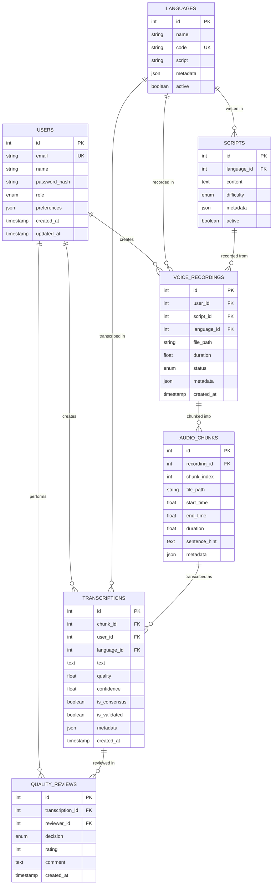

# Shrutik Architecture Overview

This document provides a comprehensive overview of Shrutik's system architecture, design principles, and technical decisions.

## 🏗️ System Architecture

Shrutik follows a modern, microservices-inspired architecture with clear separation of concerns and scalable design patterns.

### High-Level Architecture


## 🎯 Design Principles

### 1. Modularity
- **Service-Oriented**: Clear separation between different business domains
- **Loose Coupling**: Services communicate through well-defined interfaces
- **High Cohesion**: Related functionality grouped together

### 2. Scalability
- **Horizontal Scaling**: Stateless services that can be scaled independently
- **Async Processing**: Heavy operations handled by background workers
- **Caching Strategy**: Multi-layer caching for performance optimization

### 3. Reliability
- **Error Handling**: Comprehensive error handling and recovery mechanisms
- **Health Checks**: Automated monitoring and alerting
- **Data Integrity**: ACID transactions and data validation

### 4. Security
- **Authentication**: JWT-based authentication with refresh tokens
- **Authorization**: Role-based access control (RBAC)
- **Data Protection**: Encryption at rest and in transit

### 5. Maintainability
- **Clean Code**: Following Python and TypeScript best practices
- **Documentation**: Comprehensive API and code documentation
- **Testing**: High test coverage with unit, integration, and E2E tests

## 🔧 Technology Stack

### Backend Technologies

| Component | Technology | Purpose |
|-----------|------------|---------|
| **Web Framework** | FastAPI | High-performance async API framework |
| **Database** | PostgreSQL | Primary data storage with ACID compliance |
| **Cache/Queue** | Redis | Caching, session storage, and message queue |
| **Background Jobs** | Celery | Async task processing |
| **Audio Processing** | Librosa, PyDub | Audio analysis and manipulation |
| **Authentication** | JWT | Stateless authentication |
| **Validation** | Pydantic | Data validation and serialization |
| **ORM** | SQLAlchemy | Database abstraction layer |
| **Migrations** | Alembic | Database schema migrations |

### Frontend Technologies

| Component | Technology | Purpose |
|-----------|------------|---------|
| **Framework** | React 18 | Component-based UI framework |
| **Meta Framework** | Next.js | Full-stack React framework |
| **Language** | TypeScript | Type-safe JavaScript |
| **Styling** | Tailwind CSS | Utility-first CSS framework |
| **State Management** | Zustand | Lightweight state management |
| **HTTP Client** | Axios | Promise-based HTTP client |
| **Audio Recording** | MediaRecorder API | Browser audio recording |
| **Testing** | Jest, React Testing Library | Unit and integration testing |

### Infrastructure Technologies

| Component | Technology | Purpose |
|-----------|------------|---------|
| **Containerization** | Docker | Application containerization |
| **Orchestration** | Docker Compose | Multi-container application management |
| **Reverse Proxy** | Nginx | Load balancing and SSL termination |
| **Monitoring** | Prometheus, Grafana | Metrics collection and visualization |
| **Logging** | Structured logging | Centralized log management |
| **CI/CD** | GitHub Actions | Automated testing and deployment |

## 📊 Data Architecture

### Database Schema Design



### Data Flow Patterns

#### 1. Voice Recording Data Flow
```
User Input → Frontend → API → Database → File Storage → Background Processing → Chunking → Database Update
```

#### 2. Transcription Data Flow
```
User Request → API → Database Query → Cache Check → Response → User Input → Validation → Database Save → Consensus Trigger
```

#### 3. Consensus Calculation Flow
```
Transcription Submit → Background Job → Collect Related → Calculate Similarity → Weight Quality → Update Consensus → Notify Users
```

## 🔄 API Design

### RESTful API Principles

Shrutik follows REST architectural principles with some pragmatic adaptations:

- **Resource-Based URLs**: `/api/recordings`, `/api/transcriptions`
- **HTTP Methods**: GET, POST, PUT, DELETE for CRUD operations
- **Status Codes**: Proper HTTP status codes for different scenarios
- **JSON Format**: Consistent JSON request/response format
- **Pagination**: Cursor-based pagination for large datasets
- **Versioning**: API versioning through URL path (`/api/v1/`)

### API Structure

```
/api/
├── auth/
│   ├── POST /login
│   ├── POST /register
│   ├── POST /refresh
│   └── POST /logout
├── recordings/
│   ├── GET /
│   ├── POST /sessions
│   ├── POST /upload
│   └── GET /{id}/progress
├── transcriptions/
│   ├── GET /
│   ├── POST /tasks
│   ├── POST /submit
│   └── POST /skip
├── chunks/
│   ├── GET /{id}/audio
│   └── GET /{id}/info
├── admin/
│   ├── GET /stats/platform
│   ├── GET /users
│   └── GET /performance/dashboard
└── export/
    ├── POST /dataset
    └── GET /jobs/{id}/status
```

### Authentication & Authorization


## 🚀 Performance Architecture

### Caching Strategy


### Performance Optimizations

#### Backend Optimizations
- **Connection Pooling**: Database connection pooling with configurable limits
- **Query Optimization**: Indexed queries and efficient SQL patterns
- **Async Processing**: Non-blocking I/O for concurrent request handling
- **Background Jobs**: Heavy operations moved to background workers
- **Response Compression**: Gzip compression for API responses

#### Frontend Optimizations
- **Code Splitting**: Dynamic imports for reduced bundle size
- **Lazy Loading**: Components and routes loaded on demand
- **Image Optimization**: Optimized images with Next.js Image component
- **Caching**: Aggressive caching of static assets and API responses
- **Service Workers**: Offline functionality and background sync

#### Database Optimizations
- **Indexing Strategy**: Proper indexes on frequently queried columns
- **Query Optimization**: Efficient queries with proper joins and filters
- **Read Replicas**: Separate read replicas for analytics queries
- **Partitioning**: Table partitioning for large datasets

## 🔒 Security Architecture

### Security Layers


### Security Measures

#### Authentication & Authorization
- **JWT Tokens**: Stateless authentication with short-lived access tokens
- **Refresh Tokens**: Secure token refresh mechanism
- **Role-Based Access**: Granular permissions based on user roles
- **Session Management**: Secure session handling with Redis

#### Data Protection
- **Input Validation**: Comprehensive input validation using Pydantic
- **SQL Injection Prevention**: Parameterized queries with SQLAlchemy
- **XSS Protection**: Content Security Policy and input sanitization
- **CSRF Protection**: CSRF tokens for state-changing operations

#### Infrastructure Security
- **HTTPS Enforcement**: All communications encrypted with TLS
- **Security Headers**: Comprehensive security headers implementation
- **Rate Limiting**: Protection against abuse and DoS attacks
- **File Upload Security**: Secure file upload with type validation

## 📈 Monitoring & Observability

### Monitoring Stack


### Key Metrics

#### Application Metrics
- **Request Rate**: Requests per second by endpoint
- **Response Time**: P50, P95, P99 response times
- **Error Rate**: Error percentage by endpoint and status code
- **Throughput**: Data processing throughput

#### Business Metrics
- **User Engagement**: Active users, session duration
- **Data Quality**: Transcription accuracy, consensus rates
- **System Usage**: Recording uploads, transcription submissions
- **Performance**: Audio processing times, consensus calculation speed

#### Infrastructure Metrics
- **System Resources**: CPU, memory, disk usage
- **Database Performance**: Query times, connection pool status
- **Cache Performance**: Hit rates, memory usage
- **Network**: Bandwidth usage, connection counts

## 🔄 Deployment Architecture

### Environment Strategy


### Deployment Pipeline

1. **Code Commit**: Developer pushes code to repository
2. **Automated Testing**: Unit, integration, and E2E tests run
3. **Build Process**: Docker images built and tagged
4. **Staging Deployment**: Automatic deployment to staging
5. **Manual Testing**: QA and user acceptance testing
6. **Production Deployment**: Manual approval and deployment
7. **Health Checks**: Automated health verification
8. **Monitoring**: Continuous monitoring and alerting

## 🔮 Future Architecture Considerations

### Scalability Enhancements
- **Microservices**: Further decomposition into microservices
- **Event-Driven Architecture**: Event sourcing and CQRS patterns
- **Kubernetes**: Container orchestration for better scaling
- **Service Mesh**: Advanced service-to-service communication

### Performance Improvements
- **Edge Computing**: Edge nodes for global content delivery
- **Advanced Caching**: Distributed caching with Redis Cluster
- **Database Sharding**: Horizontal database partitioning
- **GraphQL**: More efficient data fetching

### AI/ML Integration
- **Automated Quality Assessment**: ML-based quality scoring
- **Smart Chunk Assignment**: AI-driven task assignment
- **Real-time Transcription**: Automatic transcription assistance
- **Anomaly Detection**: ML-based fraud and quality detection

---

This architecture provides a solid foundation for Shrutik's current needs while maintaining flexibility for future growth and enhancements.