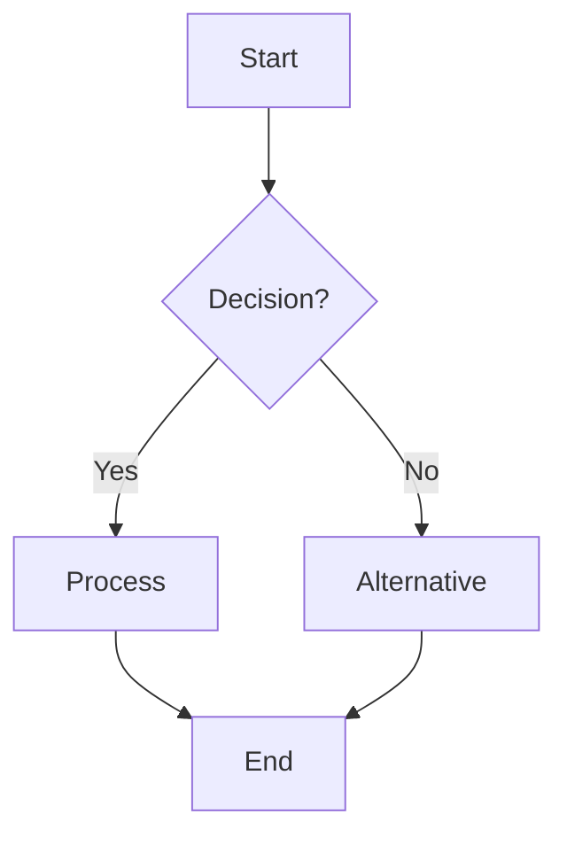

# Shrutik System Flowcharts

This directory contains visual documentation of Shrutik's system flows and processes using Mermaid diagrams. These flowcharts help developers and contributors understand the system architecture and data flow.

## Available Flowcharts

### Core System Flows
- **[Overall System Architecture](system-architecture.md)** - High-level system overview
- **[Voice Recording Flow](voice-recording-flow.md)** - Complete voice recording process
- **[Transcription Workflow](transcription-workflow.md)** - Transcription and consensus process
- **[User Authentication Flow](authentication-flow.md)** - User registration and authentication
- **[Data Processing Pipeline](data-processing-pipeline.md)** - Audio processing and chunking

### Technical Flows
- **[API Request Flow](api-request-flow.md)** - API request lifecycle
- **[Database Operations](database-operations.md)** - Database interaction patterns
- **[Caching Strategy](caching-strategy.md)** - Caching and performance optimization
- **[Background Jobs](background-jobs.md)** - Celery task processing

## How to Read These Diagrams

### Symbols and Conventions

- **Rectangles**: Processes or services
- **Diamonds**: Decision points
- **Circles**: Start/end points
- **Cylinders**: Databases or storage
- **Clouds**: External services
- **Arrows**: Data flow direction

### Color Coding

- **Blue**: User interactions
- **Green**: Successful operations
- **Red**: Error conditions
- **Yellow**: Processing/waiting states
- **Purple**: External services

## 🔧 Updating Flowcharts

When making changes to the system:

1. **Review Affected Diagrams**: Check which flowcharts need updates
2. **Update Mermaid Code**: Modify the diagram code
3. **Test Rendering**: Ensure diagrams render correctly
4. **Update Documentation**: Sync with code changes

### Mermaid Syntax Reference

## 📚 Additional Resources

- **[Mermaid Documentation](https://mermaid-js.github.io/mermaid/)**
- **[System Architecture Guide](../architecture.md)**
- **[API Documentation](../api-reference.md)**
- **[Development Guide](../local-development.md)**

## Contributing

To contribute new flowcharts or update existing ones:

1. Follow the naming convention: `kebab-case.md`
2. Include a description and context
3. Use consistent styling and colors
4. Test diagram rendering
5. Update this README if adding new diagrams

---

These visual guides complement our technical documentation and help make Shrutik more accessible to contributors of all backgrounds.