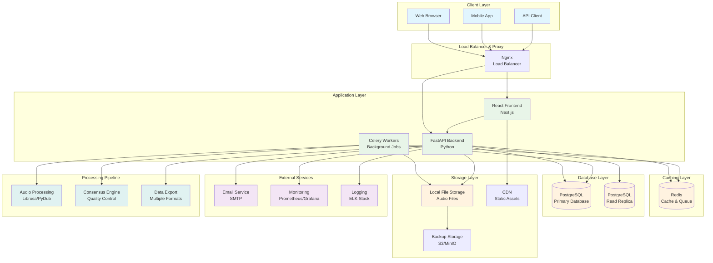

# Shrutik System Architecture

This diagram shows the high-level architecture of the Shrutik voice data collection platform, including all major components and their interactions.

## 🏗️ Overall System Architecture



## 🔧 Component Descriptions

### Client Layer
- **Web Browser**: Primary interface for contributors using React/Next.js frontend
- **Mobile App**: Future mobile application for voice contributions
- **API Client**: External integrations and automated systems

### Load Balancer & Proxy
- **Nginx**: Handles SSL termination, load balancing, and static file serving
- Routes requests to appropriate backend services
- Implements rate limiting and security headers

### Application Layer
- **React Frontend**: User interface built with Next.js and TypeScript
- **FastAPI Backend**: RESTful API server with automatic documentation
- **Celery Workers**: Background job processing for audio tasks

### Caching Layer
- **Redis**: Serves multiple purposes:
  - Session storage and caching
  - Message queue for Celery
  - Rate limiting counters
  - Real-time data caching

### Database Layer
- **PostgreSQL Primary**: Main database for all application data
- **PostgreSQL Replica**: Read-only replica for analytics and reporting
- Supports horizontal scaling and high availability

### Storage Layer
- **Local File Storage**: Audio files and uploads stored locally or on network storage
- **CDN**: Content delivery network for static assets and optimized audio delivery
- **Backup Storage**: Automated backups to S3-compatible storage

### External Services
- **Email Service**: SMTP for user notifications and system alerts
- **Monitoring**: Prometheus and Grafana for system monitoring
- **Logging**: Centralized logging with ELK stack or similar

### Processing Pipeline
- **Audio Processing**: Intelligent audio chunking and format conversion
- **Consensus Engine**: Quality control and transcription consensus algorithms
- **Data Export**: Multiple format support for dataset export

## 🔄 Data Flow Patterns

### 1. Voice Recording Flow
```
User → Frontend → Backend → Storage → Worker → Audio Processing → Database
```

### 2. Transcription Flow
```
User → Frontend → Backend → Database → Consensus Engine → Quality Metrics
```

### 3. API Request Flow
```
Client → Nginx → Backend → Cache/Database → Response → Client
```

## 🚀 Scalability Considerations

### Horizontal Scaling
- **Frontend**: Multiple instances behind load balancer
- **Backend**: Stateless API servers can be scaled horizontally
- **Workers**: Auto-scaling based on queue length
- **Database**: Read replicas for query distribution

### Performance Optimization
- **Caching**: Multi-layer caching strategy with Redis
- **CDN**: Global content delivery for static assets
- **Database**: Connection pooling and query optimization
- **Background Jobs**: Async processing for heavy operations

### High Availability
- **Load Balancing**: Multiple instances of each service
- **Database Replication**: Master-slave setup with failover
- **Health Checks**: Automated monitoring and alerting
- **Backup Strategy**: Regular automated backups

## 🔒 Security Architecture

### Authentication & Authorization
- JWT-based authentication with refresh tokens
- Role-based access control (RBAC)
- API key authentication for external clients

### Data Protection
- HTTPS/TLS encryption for all communications
- Database encryption at rest
- Secure file upload validation
- Input sanitization and validation

### Network Security
- Firewall rules and network segmentation
- Rate limiting and DDoS protection
- Security headers and CORS configuration
- Regular security audits and updates

## 📊 Monitoring & Observability

### Metrics Collection
- Application performance metrics
- System resource monitoring
- Business metrics and analytics
- Error tracking and alerting

### Logging Strategy
- Structured logging with correlation IDs
- Centralized log aggregation
- Log retention and archival policies
- Security event logging

### Health Checks
- Service health endpoints
- Database connectivity checks
- External service dependency monitoring
- Automated failover mechanisms

## 🔄 Deployment Architecture

### Development Environment
- Local development with Docker Compose
- Hot reload for rapid development
- Isolated test databases
- Mock external services

### Staging Environment
- Production-like environment for testing
- Automated deployment pipeline
- Integration testing
- Performance testing

### Production Environment
- Multi-zone deployment for high availability
- Blue-green deployment strategy
- Automated rollback capabilities
- Comprehensive monitoring and alerting

---

This architecture supports Shrutik's mission of democratizing voice technology while maintaining high performance, security, and scalability standards.