# Transcription Workflow

This flowchart details the complete transcription process in Shrutik, including task assignment, transcription submission, consensus building, and quality control.

## 📝 Complete Transcription Process

## 🎯 Task Assignment Algorithm

## 📊 Consensus Algorithm

```mermaid
flowchart TD
    CHUNK[Audio Chunk] --> COLLECT[Collect All Transcriptions]
    COLLECT --> COUNT{Transcription Count}
    
    COUNT -->|< 3| NEED_MORE[Need More Transcriptions]
    COUNT -->|≥ 3| ANALYZE[Analyze Transcriptions]
    
    ANALYZE --> SIMILARITY[Calculate Text Similarity]
    SIMILARITY --> CLUSTER[Group Similar Transcriptions]
    CLUSTER --> WEIGHT[Apply Quality Weights]
    
    WEIGHT --> SCORE[Calculate Consensus Scores]
    SCORE --> THRESHOLD{Above Threshold?}
    
    THRESHOLD -->|No| NEED_MORE
    THRESHOLD -->|Yes| SELECT_CONSENSUS[Select Consensus Text]
    
    SELECT_CONSENSUS --> VALIDATE_CONSENSUS[Validate Consensus Quality]
    VALIDATE_CONSENSUS --> MARK_COMPLETE[Mark Chunk as Complete]
    
    NEED_MORE --> PRIORITY[Increase Priority for Assignment]
    MARK_COMPLETE --> UPDATE_CONTRIBUTORS[Update Contributor Stats]
    
    %% Consensus Calculation Details
    subgraph "Similarity Calculation"
        LEVENSHTEIN[Levenshtein Distance]
        SEMANTIC[Semantic Similarity]
        PHONETIC[Phonetic Matching]
        COMBINED[Combined Score]
    end
    
    SIMILARITY --> LEVENSHTEIN
    SIMILARITY --> SEMANTIC
    SIMILARITY --> PHONETIC
    LEVENSHTEIN --> COMBINED
    SEMANTIC --> COMBINED
    PHONETIC --> COMBINED
    COMBINED --> CLUSTER
```

## 🔄 Quality Control Process

## 📈 Progress Tracking

### Individual User Progress

### System-wide Progress

## 🎯 Optimization Strategies

### Performance Optimizations
- **Caching**: Cache frequently accessed chunks and user data
- **Preloading**: Preload next chunks while user works on current ones
- **CDN**: Optimize audio delivery through CDN
- **Compression**: Compress audio for faster loading

### User Experience Optimizations
- **Smart Assignment**: Assign chunks based on user expertise and preferences
- **Progress Indicators**: Clear progress tracking and feedback
- **Keyboard Shortcuts**: Efficient transcription interface
- **Auto-save**: Prevent data loss with automatic saving

### Quality Optimizations
- **Difficulty Balancing**: Mix easy and challenging chunks
- **Context Provision**: Provide helpful context and hints
- **Real-time Feedback**: Immediate quality feedback
- **Consensus Weighting**: Weight transcriptions by contributor reliability

## 🚨 Error Handling & Recovery

### Common Error Scenarios
1. **Session Timeout**
   - Auto-save work in progress
   - Seamless session renewal
   - Recovery of unsaved work

2. **Network Interruption**
   - Offline work capability
   - Automatic retry mechanisms
   - Queue submissions for later

3. **Audio Loading Issues**
   - Fallback audio formats
   - Progressive loading
   - Error reporting and alternatives

4. **Consensus Conflicts**
   - Human review escalation
   - Weighted voting systems
   - Quality threshold adjustments

### Recovery Mechanisms

---

This comprehensive transcription workflow ensures high-quality data collection while providing an engaging and efficient experience for contributors.