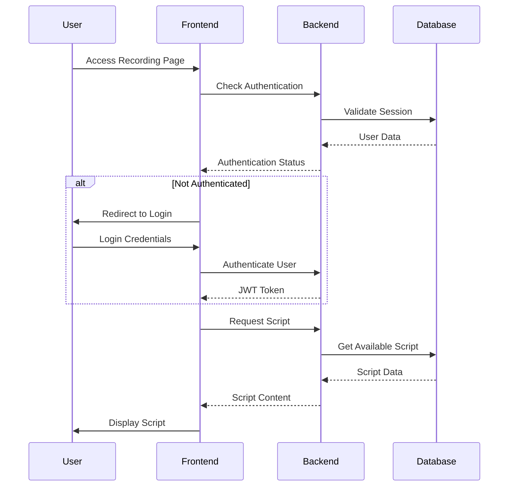
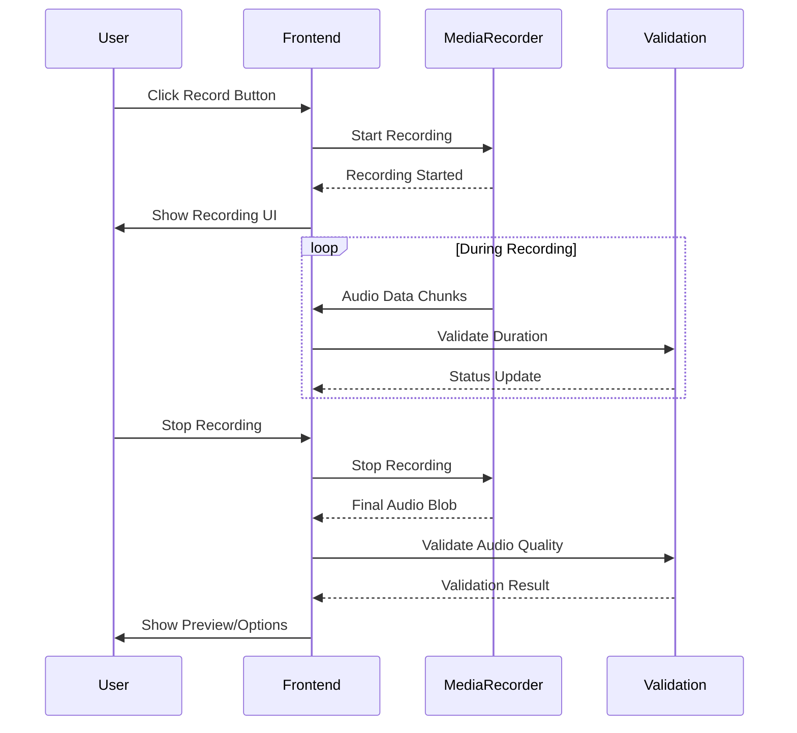
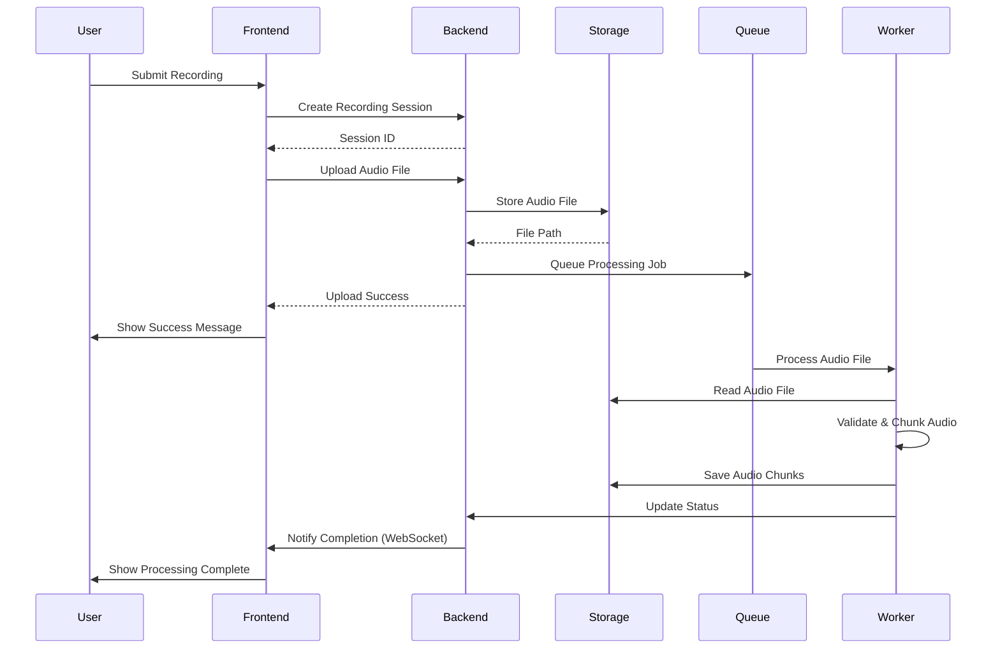
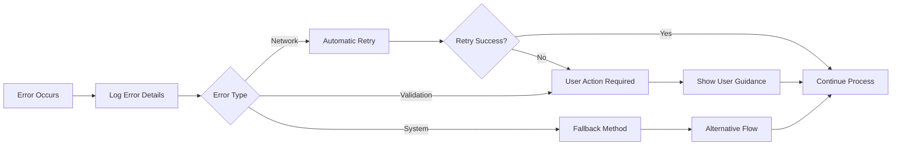

# Voice Recording Flow

This flowchart details the complete process of voice recording in Shrutik, from user interaction to final storage and processing.

## Complete Voice Recording Process

```mermaid
flowchart TD
    START([User Starts Recording]) --> AUTH{User Authenticated?}
    
    AUTH -->|No| LOGIN[Redirect to Login]
    LOGIN --> AUTH
    AUTH -->|Yes| SCRIPT[Get Script for Recording]
    
    SCRIPT --> PERM{Microphone Permission?}
    PERM -->|No| REQ_PERM[Request Microphone Access]
    REQ_PERM --> PERM_GRANT{Permission Granted?}
    PERM_GRANT -->|No| ERROR_PERM[Show Permission Error]
    PERM_GRANT -->|Yes| PERM
    
    PERM -->|Yes| SETUP[Setup Audio Recording]
    SETUP --> DISPLAY[Display Script Text]
    DISPLAY --> READY[Show Record Button]
    
    READY --> RECORD_START[User Clicks Record]
    RECORD_START --> RECORDING[Recording Audio...]
    
    RECORDING --> MONITOR{Monitor Recording}
    MONITOR --> CHECK_DURATION{Duration < Max?}
    CHECK_DURATION -->|No| AUTO_STOP[Auto Stop Recording]
    CHECK_DURATION -->|Yes| USER_STOP{User Stops?}
    
    USER_STOP -->|No| MONITOR
    USER_STOP -->|Yes| STOP_REC[Stop Recording]
    AUTO_STOP --> STOP_REC
    
    STOP_REC --> VALIDATE[Validate Audio]
    VALIDATE --> VALID{Audio Valid?}
    
    VALID -->|No| ERROR_AUDIO[Show Audio Error]
    ERROR_AUDIO --> READY
    
    VALID -->|Yes| PREVIEW[Show Audio Preview]
    PREVIEW --> USER_ACTION{User Action}
    
    USER_ACTION -->|Re-record| READY
    USER_ACTION -->|Cancel| CANCEL[Cancel Recording]
    USER_ACTION -->|Submit| PREPARE[Prepare Upload]
    
    PREPARE --> CREATE_SESSION[Create Recording Session]
    CREATE_SESSION --> SESSION_VALID{Session Created?}
    
    SESSION_VALID -->|No| ERROR_SESSION[Session Creation Error]
    SESSION_VALID -->|Yes| UPLOAD[Upload Audio File]
    
    UPLOAD --> UPLOAD_PROGRESS[Show Upload Progress]
    UPLOAD_PROGRESS --> UPLOAD_COMPLETE{Upload Complete?}
    
    UPLOAD_COMPLETE -->|No| UPLOAD_ERROR[Upload Error]
    UPLOAD_ERROR --> RETRY{Retry Upload?}
    RETRY -->|Yes| UPLOAD
    RETRY -->|No| CANCEL
    
    UPLOAD_COMPLETE -->|Yes| SAVE_DB[Save to Database]
    SAVE_DB --> QUEUE_PROCESSING[Queue for Processing]
    QUEUE_PROCESSING --> SUCCESS[Show Success Message]
    
    SUCCESS --> NEXT_ACTION{User Next Action}
    NEXT_ACTION -->|Record Another| SCRIPT
    NEXT_ACTION -->|View Progress| DASHBOARD[Go to Dashboard]
    NEXT_ACTION -->|Logout| LOGOUT[Logout User]
    
    CANCEL --> CLEANUP[Cleanup Resources]
    ERROR_PERM --> CLEANUP
    ERROR_SESSION --> CLEANUP
    CLEANUP --> END([End])
    
    DASHBOARD --> END
    LOGOUT --> END

    %% Background Processing (Async)
    QUEUE_PROCESSING -.-> BG_START[Background Processing Starts]
    BG_START -.-> VALIDATE_FILE[Validate Audio File]
    VALIDATE_FILE -.-> CHUNK_AUDIO[Intelligent Audio Chunking]
    CHUNK_AUDIO -.-> SAVE_CHUNKS[Save Audio Chunks]
    SAVE_CHUNKS -.-> UPDATE_STATUS[Update Recording Status]
    UPDATE_STATUS -.-> NOTIFY_USER[Notify User of Completion]

    %% Styling
    classDef userAction fill:#e3f2fd
    classDef process fill:#e8f5e8
    classDef decision fill:#fff3e0
    classDef error fill:#ffebee
    classDef success fill:#e0f2f1
    classDef background fill:#f3e5f5

    class START,RECORD_START,USER_STOP,USER_ACTION,NEXT_ACTION userAction
    class SETUP,DISPLAY,RECORDING,VALIDATE,PREPARE,UPLOAD,SAVE_DB process
    class AUTH,PERM,PERM_GRANT,CHECK_DURATION,VALID,SESSION_VALID,UPLOAD_COMPLETE,RETRY decision
    class ERROR_PERM,ERROR_AUDIO,ERROR_SESSION,UPLOAD_ERROR error
    class SUCCESS,NOTIFY_USER success
    class BG_START,VALIDATE_FILE,CHUNK_AUDIO,SAVE_CHUNKS,UPDATE_STATUS background
```

## Process Breakdown

### 1. User Authentication & Setup

### 2. Audio Recording Process

### 3. File Upload & Processing

## 🔍 Validation Steps

### Audio Quality Validation
- **Duration Check**: 1-60 seconds
- **Format Validation**: Supported audio formats
- **File Size**: Maximum 100MB
- **Sample Rate**: Minimum quality requirements
- **Noise Level**: Basic noise detection

### Security Validation
- **File Type**: MIME type verification
- **Malware Scan**: Basic security checks
- **User Permissions**: Recording quota limits
- **Session Validation**: Valid recording session

## Performance Optimizations

### Frontend Optimizations
- **Progressive Upload**: Chunked file upload
- **Compression**: Client-side audio compression
- **Caching**: Cache user preferences and scripts
- **Offline Support**: Queue recordings when offline

### Backend Optimizations
- **Async Processing**: Background job processing
- **Connection Pooling**: Database connection optimization
- **Caching**: Redis caching for frequent data
- **CDN Integration**: Optimized file delivery

## Error Handling

### Common Error Scenarios
1. **Microphone Access Denied**
   - Show clear instructions
   - Provide alternative options
   - Guide user through browser settings

2. **Network Connection Issues**
   - Implement retry logic
   - Show connection status
   - Queue uploads for later

3. **File Upload Failures**
   - Automatic retry with exponential backoff
   - Resume interrupted uploads
   - Clear error messages

4. **Audio Quality Issues**
   - Real-time quality feedback
   - Recording tips and guidance
   - Option to re-record

### Error Recovery

## Monitoring & Analytics

### Key Metrics
- **Recording Success Rate**: Percentage of successful recordings
- **Average Recording Duration**: User engagement metrics
- **Upload Success Rate**: Technical performance metrics
- **Processing Time**: Background job performance
- **Error Rates**: System reliability metrics

### User Experience Metrics
- **Time to First Recording**: Onboarding effectiveness
- **Recording Abandonment Rate**: UX friction points
- **Retry Attempts**: Error recovery effectiveness
- **User Satisfaction**: Quality ratings and feedback

---

This comprehensive flow ensures a smooth, reliable voice recording experience while maintaining high quality standards and robust error handling.