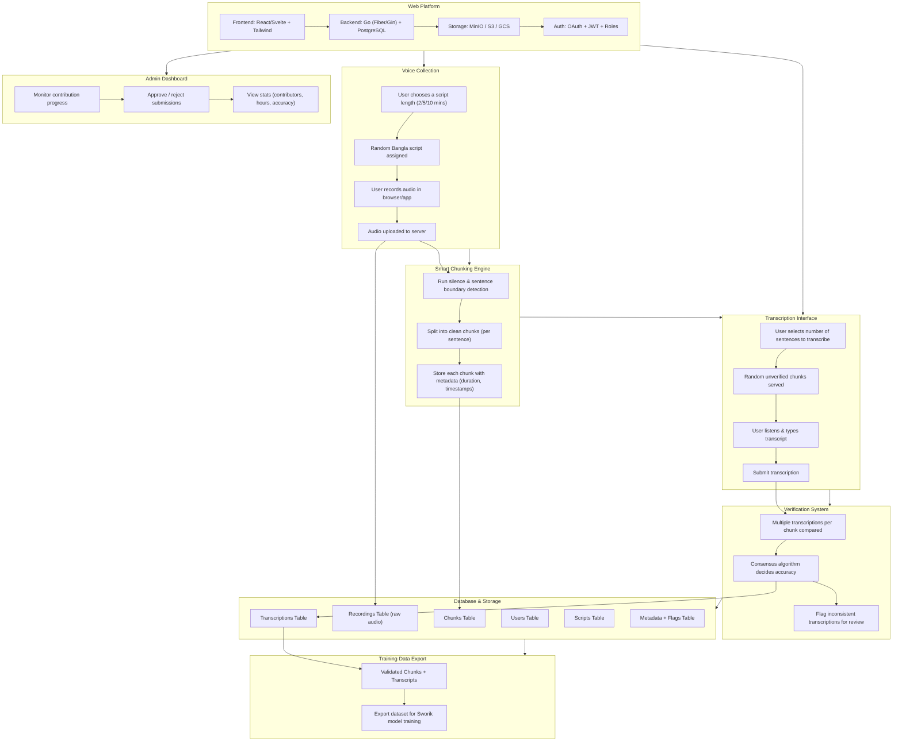

This diagram shows the *entire pipeline*: from users contributing data to how it’s chunked, transcribed, validated, and stored for Sworik.

---

---

### 💡 Explanation

* **A → B → C → D → E → F**
  This is your *data journey*:
  recording → smart chunking → transcription → verification → database → export for training.

* **G** (Web Platform) ties everything together - UI, backend, and storage.

* **H** (Admin Dashboard) ensures quality control and community contribution tracking.

