```mermaid
flowchart TD

subgraph A["👨‍💻 Contributors"]
    A1["Fork Onuronon repo"]
    A2["Work on features (chunking, UI, verification logic, etc.)"]
    A3["Test locally with sample dataset"]
    A4["Submit PRs for review"]
    A1 --> A2 --> A3 --> A4
end

subgraph B["🧑‍🔧 Maintainers"]
    B1["Review & merge PRs"]
    B2["Run CI/CD (lint, test, build, deploy)"]
    B3["Update backend / frontend services"]
    B4["Manage contributor credits + leaderboard"]
    A4 --> B1 --> B2 --> B3 --> B4
end

subgraph C["⚙️ Infrastructure"]
    C1["Server Hosting (Render / Fly.io / VPS)"]
    C2["PostgreSQL + MinIO setup"]
    C3["API Gateway + Auth"]
    C4["Dockerized deployment"]
    B3 --> C1 --> C2 --> C3 --> C4
end

subgraph D["📊 Data Review & Validation"]
    D1["Run automated scripts to check data consistency"]
    D2["Remove corrupted or mismatched chunks"]
    D3["Manually audit low-confidence transcriptions"]
    D4["Approve for final export"]
    C2 --> D1 --> D2 --> D3 --> D4
end

subgraph E["📦 Export & Integration"]
    E1["Run export pipeline script"]
    E2["Package dataset: audio + text + metadata"]
    E3["Push dataset to private Sworik repository"]
    E4["Sworik AI model retrains on new validated data"]
    D4 --> E1 --> E2 --> E3 --> E4
end

subgraph F["🧠 Feedback Loop"]
    F1["Sworik team analyzes weak spots in model"]
    F2["Reports which phonemes or accents need more data"]
    F3["Onuronon community targets those areas next"]
    E4 --> F1 --> F2 --> F3
end

%% Developer and system flow connections
A --> B --> C --> D --> E --> F
```

---

### 🧩 Breakdown of the Flow

| Section                     | Role                        | Description                                                 |
| --------------------------- | --------------------------- | ----------------------------------------------------------- |
| **A. Contributors**         | Open-source devs            | Add features, fix bugs, or enhance UX.                      |
| **B. Maintainers**          | Core team                   | Manage PRs, CI/CD, and community.                           |
| **C. Infrastructure**       | DevOps                      | Keeps backend + DB + storage healthy.                       |
| **D. Data Review**          | Data engineers / volunteers | Ensure transcription and chunk accuracy.                    |
| **E. Export & Integration** | Sworik pipeline             | Turns Annotator data → training dataset.                     |
| **F. Feedback Loop**        | Continuous improvement      | Sworik tells Annotator what kind of new data is needed next. |

